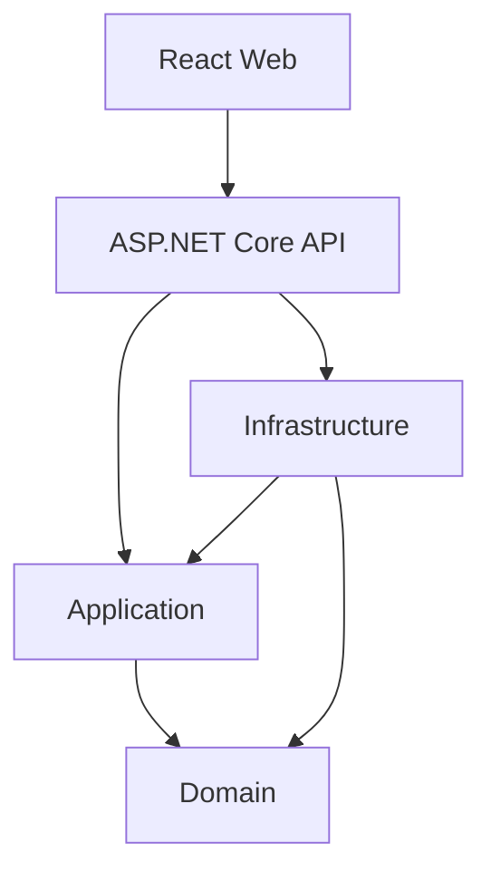
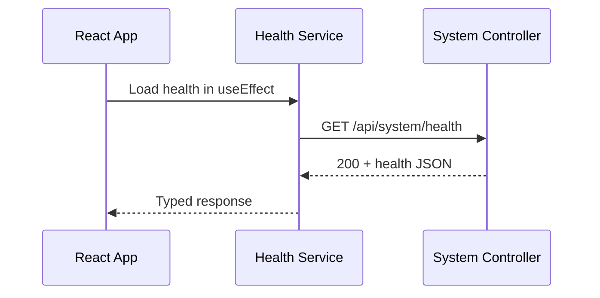
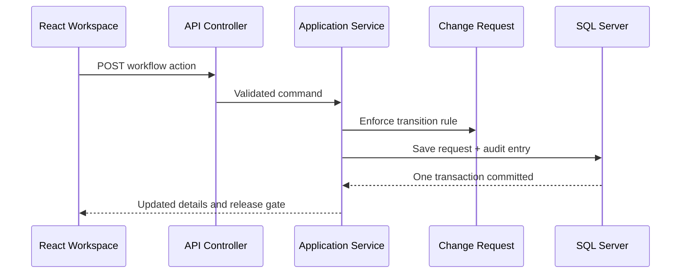

# ChangeGuard AI - Architecture

## 1. Purpose

This document describes how ChangeGuard is organised, why the boundaries exist, and how requests flow through the system.

The detailed reason for selecting a modular monolith is recorded separately in [`adr/0001-use-modular-monolith.md`](adr/0001-use-modular-monolith.md).

## 2. Architecture Style

ChangeGuard starts as a modular monolith using Clean Architecture principles.

This means:

- The backend is initially deployed as one application.
- Business capabilities are separated by clear module boundaries.
- Business rules do not depend on databases, cloud services, or user-interface frameworks.
- External implementations are accessed through abstractions where that separation provides value.
- A module can be extracted later if evidence supports independent deployment.

## 3. High-Level Structure



The arrows show compile-time or runtime collaboration toward core business behaviour. `Domain` has no project dependency on the other ChangeGuard projects.

## 4. Project Responsibilities

### ChangeGuard.Domain

Owns business concepts and rules.

Implemented examples:

- Change request aggregate
- Guarded workflow transitions
- SLA policy
- Rule-based release-readiness decision
- Audit-entry entity

It must not contain EF Core, HTTP, Azure SDK, React, or controller code.

### ChangeGuard.Application

Owns application use cases and orchestration.

Implemented examples:

- Create and search change requests
- Record QA evidence and rollback plans
- Apply controlled workflow actions
- Calculate SLA and release readiness
- Retrieve details, dashboard metrics, and audit history

It may define interfaces that Infrastructure implements.

### ChangeGuard.Infrastructure

Implements technical concerns.

Implemented examples:

- EF Core persistence
- SQL Server access
- Unique-reference enforcement
- Database migrations and readiness health check

Later examples:

- GitHub integration
- Blob storage
- Message publication
- Email and notification delivery

Infrastructure must not become the owner of business rules.

### ChangeGuard.Api

Acts as the backend entry point and composition root.

Responsibilities include:

- HTTP routing
- Request and response contracts
- Authentication and authorization setup
- Middleware
- Dependency registration
- CORS configuration
- OpenAPI exposure

Controllers should remain thin and delegate business use cases to Application.

### ChangeGuard.React

Contains the active React user interface.

Responsibilities include:

- Pages and reusable visual components
- Client-side form validation
- Typed Fetch services
- User-visible state and error handling
- Route and access experience

React must communicate through API contracts and must never connect directly to the database.

`ChangeGuard.Web` contains the former Angular client temporarily as a rollback and learning reference. It is no longer built by Docker Compose or the frontend CI job.

## 5. Foundation Vertical Slice



Detailed flow:

1. Vite bootstraps the React `App` function component.
2. `useEffect` calls the typed system-health service and owns its loading state.
3. The service builds the endpoint from Vite environment configuration.
4. the Fetch API sends `GET /api/system/health` with an abort signal.
5. ASP.NET Core routing selects `SystemController.GetHealth`.
6. The controller returns `ActionResult<SystemHealthResponse>` with HTTP 200.
7. The typed Promise resolves to `SystemHealthResponse`.
8. React state records the success or actionable error state.
9. React renders the live API status and cleans up the request when the component unmounts.

This original slice proved the basic development wiring. The current application extends it with SQL-backed creation, querying, workflow, release evidence, SLA, audit, dashboard, tests, containers, and CI validation. It does not yet prove production authentication, an Azure deployment, or AI functionality.

## 6. Current Change-Request Flow



Read-only queries use `AsNoTracking`. Mutations load one tracked aggregate, apply the domain method, add an audit entry, and call `SaveChangesAsync` once so state and audit history are committed atomically.

## 7. Dependency Rules

- Domain must not reference Application, Infrastructure, API, or Web.
- Application may reference Domain.
- Infrastructure may implement interfaces defined by Application.
- API may compose Application and Infrastructure.
- Web may call only documented HTTP endpoints.
- Business rules must not be implemented only in React because API clients could bypass them.
- Secret values must not be placed in frontend source code.

## 8. Loose Coupling

Loose coupling will be supported through:

- Interfaces at meaningful external boundaries
- Dependency injection
- Domain events for in-process business reactions
- Integration events when communication crosses a deployment boundary
- Stable API contracts

Interfaces should not be created for every class automatically. They are useful when a boundary, alternate implementation, isolation requirement, or testing seam exists.

## 9. Security Boundaries

- CORS permits approved browser origins; it does not authenticate users.
- Authentication establishes identity.
- Authorization determines permitted actions.
- Protected workflow transitions must be enforced by the API.
- Client-side validation improves usability but is not a security boundary.
- Secrets will be held in appropriate server-side configuration and later Azure Key Vault.

## 10. Data and Integration Direction

The implemented persistence path is:

```text
React -> API -> Application -> Persistence abstraction -> Infrastructure -> SQL Server
```

The planned external-integration path is:

```text
Application use case -> Integration abstraction -> Infrastructure adapter -> External service
```

## 11. Observability

Implemented foundations include:

- Structured application logs
- Correlation identifiers
- Process liveness and database readiness endpoints
- Safe `ProblemDetails` error responses

Later production observability includes:

- Metrics
- Distributed traces
- Application Insights dashboards and alerts

## 12. Evolution Rules

A module should be considered for service extraction only when evidence demonstrates a need such as:

- Independent scaling
- Independent release cadence
- Strong ownership boundary
- Isolation or availability requirement
- Materially different technology requirement

Before extraction, define API or event contracts, data ownership, failure handling, monitoring, and deployment responsibility.

## 13. Current Limitations

The current MVP has SQL persistence, a business workflow, tests, container definitions, and CI validation. The following remain deliberate later phases:

- Microsoft Entra authentication and role-based authorization
- Azure resource provisioning and deployment
- Blob-backed file evidence
- asynchronous notifications or Service Bus integration
- AI-assisted requirement and risk analysis
- production telemetry dashboards and alert rules

Planned functionality must not be described as implemented until it has been deployed and verified.
